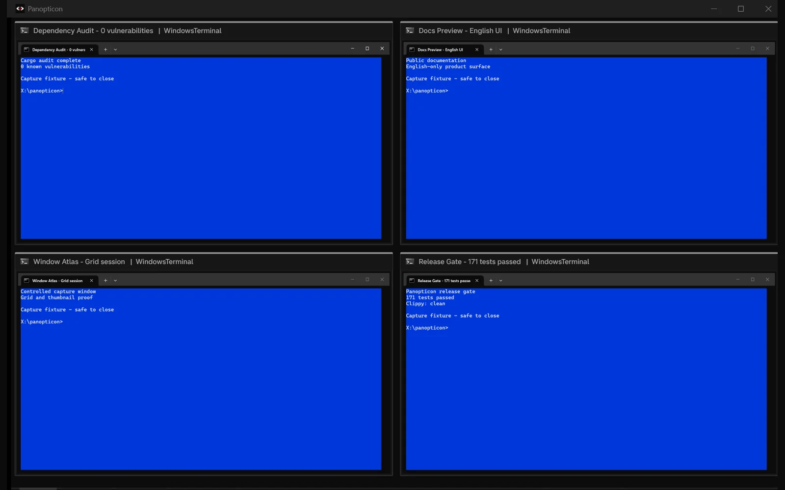
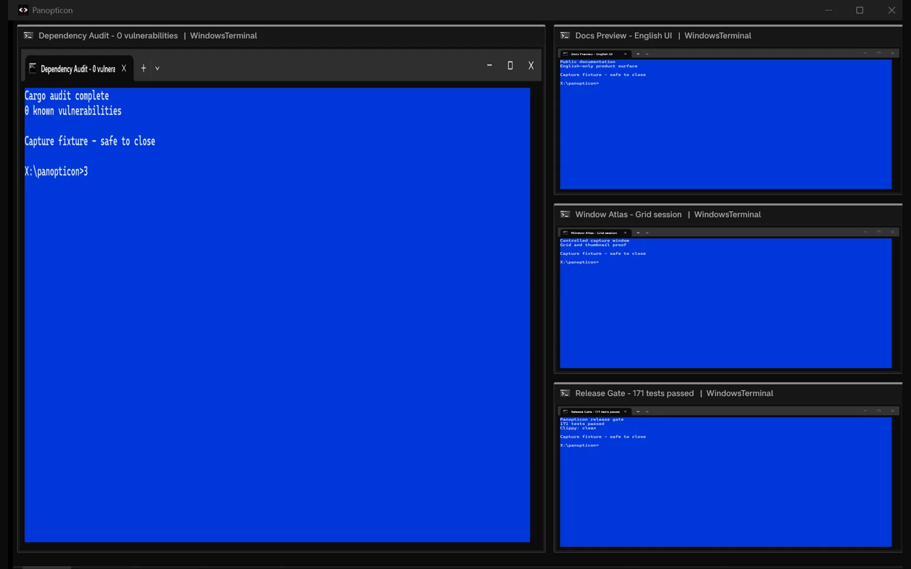
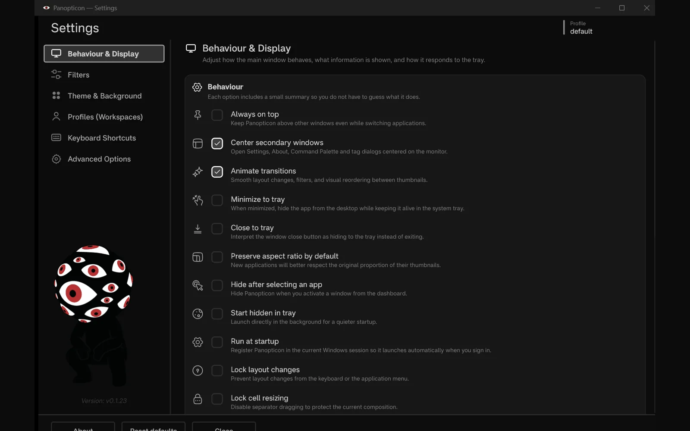
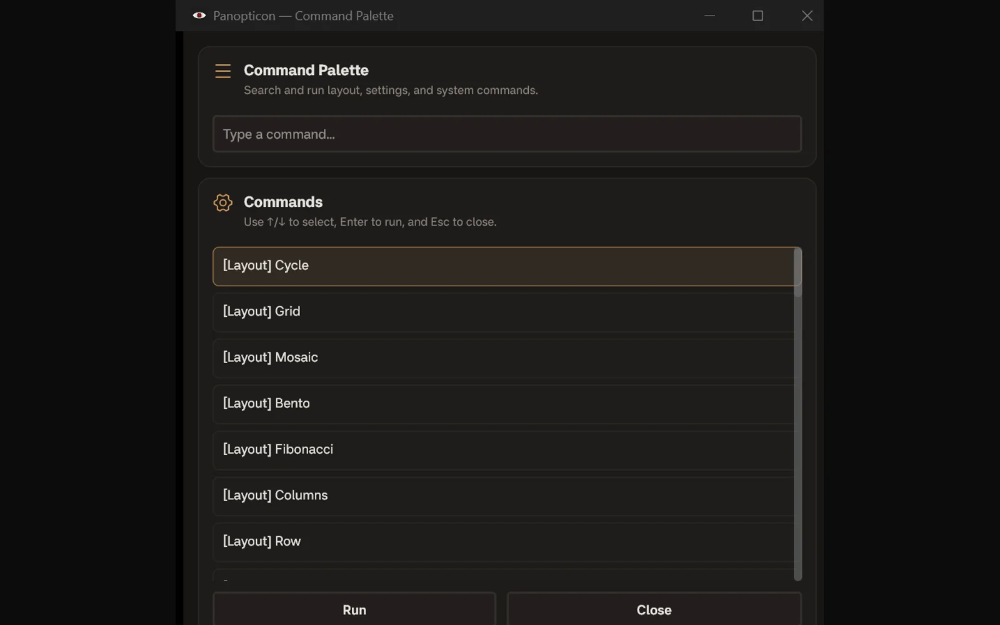

<p align="center">
  <picture>
    <source media="(prefers-color-scheme: dark)" srcset="https://shieldcn.dev/header/document.svg?title=Panopticon&subtitle=Every+open+window.+One+live+control+room.&logo=windows&theme=red&align=center&mode=dark" />
    
  </picture>
</p>

<p align="center">
  <a href="https://github.com/gvastethecreator/panopticon/actions/workflows/ci.yml"></a>
  <a href="https://gvastethecreator.github.io/panopticon/"></a>
  <a href="https://rustup.rs/"></a>
  <a href="https://github.com/gvastethecreator/panopticon/stargazers"></a>
  <a href="LICENSE"></a>
</p>

*Desktop utility for viewing, organizing, and activating your open windows through live thumbnails on Windows 10/11.*

It discovers real top-level windows, renders their live previews, and lets you manage them in a single control room.

[Project site](https://gvastethecreator.github.io/panopticon/) · [Latest release](https://github.com/gvastethecreator/panopticon/releases/latest) · [Source and issues](https://github.com/gvastethecreator/panopticon)

- 👁️ see many windows at once without constantly alt-tabbing.
- 👁️ switch between several layout strategies depending on the task.
- 👁️ keep a persistent visual workspace with filters, grouping, and tags.
- 👁️ hide the app in the tray and bring it back instantly when needed.
- 👁️ local-first, with no accounts or telemetry; only the bounded GitHub release update check uses the network.
- 👁️ **7 layout modes**: `Grid`, `Mosaic`, `Bento`, `Fibonacci`, `Columns`, `Row`, and `Column`.
- 👁️ **Per-app rules** for hiding, aspect ratio, color, tags, and thumbnail refresh mode.
- 👁️ **Grouping and filters** by app, monitor, title, class, and tag.
- 👁️ **Tray utility + appbar/dock mode** for always-available workflows.
- 👁️ **Campbell-first themes, core color overrides, backdrop opacity, background images with fit modes + opacity, animations, customizable shortcuts, workspaces, and persistence** through local TOML files.
- 👁️ **English-only UI** across the dashboard, settings, tray, dialogs, and command palette.

---
> If you want the full guide jump to **[`docs/README.md`](docs/README.md)**.

## Product tour

The dashboard captures use four controlled Windows Terminal fixtures in an isolated workspace. No personal window title or content is included.

| Grid control room | Bento layout |
| --- | --- |
|  |  |
| **English Settings** | **Command Palette** |
|  |  |

See [capture provenance](docs/assets/screenshots/README.md) for the isolation and privacy boundary.

## 💾 Download

- **Latest release:** [github.com/gvastethecreator/panopticon/releases/latest](https://github.com/gvastethecreator/panopticon/releases/latest)
- **Build from source:** see [Quick start](#quick-start)

## Quick start

```bash
cargo run --locked
```

For an optimized build use `cargo run --release --locked`. VS Code users can run `♻️ CI` from [`.vscode/tasks.json`](.vscode/tasks.json) for the full check sequence.

Dependency policy and reviewed changelogs live in [`docs/DEPENDENCIES.md`](docs/DEPENDENCIES.md).
The current readiness and native-runtime limits are tracked in [`docs/project-readiness.md`](docs/project-readiness.md)
and [`docs/QUALITY_AUDIT.md`](docs/QUALITY_AUDIT.md).


## First minute with Panopticon

1. Launch the app with a few normal desktop windows already open.
2. Press `Tab` or `1` to `7` to explore the available layouts.
3. Left-click a thumbnail to activate that window.
4. Right-click a thumbnail to open per-window actions.
5. Press `O` to open settings and review theme, filters, and workspaces.
6. Use the tray icon to hide/show the dashboard without closing it.

### Handy shortcuts


| Input | Action |
| --- | --- |
| `Tab` | Next layout |
| `1` ... `7` | Select layout directly |
| `0` | Reset custom ratios for the current layout |
| `R` | Refresh windows |
| `A` | Toggle animations |
| `H` | Show/hide status bar |
| `I` | Show/hide window metadata |
| `P` | Toggle always-on-top |
| `T` | Next theme |
| `Shift` + `T` | Previous theme |
| `O` | Open settings |
| `F1` | Open About window |
| `M` | Open application menu |
| `Ctrl` + `Alt` + `P` | Activate and focus Panopticon globally |
| `Alt` | Toggle status bar |
| `Esc` | Exit |

---
- For deep technical details, check the [docs](docs/README.md) folder.
- For feature requests and suggestions, create an issue or submit a PR.
- If you like this project, consider giving it a star or becoming a sponsor.
---

<h4 align="right">Support the further development of this tool 🤍</h4>
<p align="right">
  <a href="https://github.com/sponsors/gvastethecreator/"></a>
  <a href="https://ko-fi.com/gvaste"></a>
  <a href="https://x.com/gvastebb"></a>
</p>
