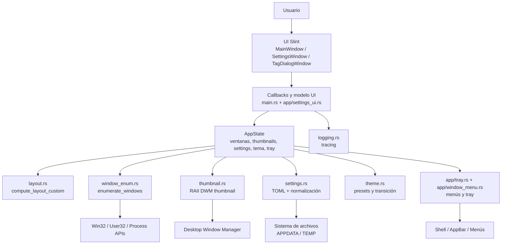
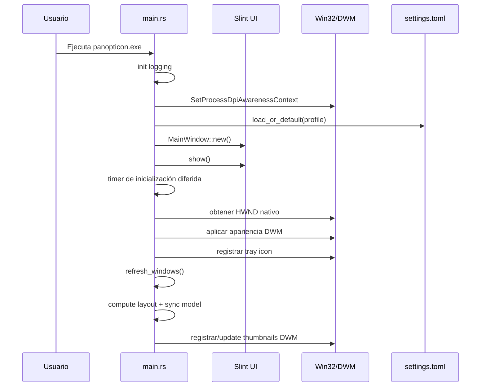

# Arquitectura de Panopticon

## Resumen

Panopticon es una aplicación nativa para Windows construida alrededor de cuatro piezas principales:

1. **Enumeración Win32** para descubrir ventanas utilizables.
2. **Miniaturas DWM** para renderizar previsualizaciones vivas sin copiar bitmaps.
3. **Motor de layouts puro** para calcular geometría y separadores persistibles.
4. **UI Slint** para presentar el tablero, settings y diálogos.

El proyecto no utiliza backend, red, base de datos ni servicios externos. Toda la arquitectura es local y depende de APIs del sistema operativo.

## Vista por capas



## Flujo de arranque



## Flujo de runtime

### 1. Descubrimiento de ventanas

`window_enum.rs` llama a `EnumWindows` y construye `WindowInfo` con:

- `hwnd`
- `title`
- `app_id`
- `process_name`
- `process_path`
- `class_name`
- `monitor_name`

Las ventanas se filtran antes de entrar en el estado principal.

### 2. Materialización del estado visible

`main.rs` convierte `WindowInfo` en `ManagedWindow`, que añade:

- thumbnail DWM opcional;
- rectángulo objetivo y rectángulo mostrado;
- tamaño fuente del thumbnail;
- timestamp de refresco del thumbnail;
- icono caché para render secundario.

### 3. Layout

`layout.rs` recibe:

```text
(layout, area, count, aspect_hints, custom_ratios)
```

y devuelve:

```text
LayoutResult { rects, separators }
```

Esto permite separar con bastante limpieza la geometría pura de la integración Win32/Slint.

### 4. Sincronización con DWM

`update_dwm_thumbnails()`:

- asegura que el `Thumbnail` exista;
- calcula el rectángulo de destino real dentro de la tarjeta;
- aplica preserve-aspect si corresponde;
- respeta viewport, toolbar, padding y footer;
- maneja modos `Realtime`, `Frozen` e `Interval`;
- libera thumbnails cuando la ventana fuente está minimizada o deja de ser válida.

### 5. Sincronización con la UI

`sync_model_to_slint()` actualiza el modelo `ThumbnailData` y los `ResizeHandleData` que usa `ui/main.slint`.

## Módulos principales

| Módulo | Rol arquitectónico |
| --- | --- |
| `src/main.rs` | orquestación principal, timers, AppState, callbacks, tray, dock, menús, settings window |
| `src/layout.rs` | motor geométrico puro y testeable |
| `src/window_enum.rs` | descubrimiento Win32 y filtrado inicial |
| `src/thumbnail.rs` | wrapper RAII para `HTHUMBNAIL` |
| `src/settings.rs` | persistencia, normalización y reglas por aplicación |
| `src/theme.rs` | catálogo de temas, resolución e interpolación |
| `src/app/tray.rs` | iconos, tray icon y menús de aplicación |
| `src/app/window_menu.rs` | menú contextual por ventana |
| `src/app/settings_ui.rs` | binding entre settings persistidos y ventana de configuración |
| `ui/main.slint` | definición visual de ventanas, tarjetas, toolbar, overlays y diálogos |

## Estado central

El runtime gira alrededor de `AppState`, que contiene al menos estas responsabilidades:

- `hwnd` de la ventana principal;
- colección de `ManagedWindow`;
- layout actual;
- settings cargados;
- estado de hover/selección;
- icono de tray;
- tema actual y posible animación entre temas;
- información de scroll, dock y separadores.

Es un estado grande y muy centralizado. Esa centralización simplifica la coordinación del event loop, pero también convierte a `main.rs` en el archivo más denso del proyecto.

## Timers y ciclos periódicos

Panopticon usa tres timers principales:

| Timer | Frecuencia | Responsabilidad |
| --- | --- | --- |
| UI timer | ~16 ms | drenar acciones pendientes, detectar resize, animar layout, animar tema y re-sincronizar thumbnails |
| Refresh timer | configurable (`1s`, `2s`, `5s`, `10s`) | re-enumerar ventanas y reconciliar estado |
| Scrollbar timer | 200 ms | auto-ocultar overlay scrollbar tras inactividad |

## Win32 subclassing

La ventana principal Slint se subclasifica para interceptar mensajes Win32 que la UI declarativa por sí sola no resuelve del todo bien:

- `WM_TRAYICON`
- `TaskbarCreated`
- `WM_APPBAR_CALLBACK`
- `WM_CLOSE`
- `WM_SIZE`
- `WM_SHOWWINDOW`
- `WM_MOUSEWHEEL`
- `WM_MBUTTONDOWN` / `WM_MBUTTONUP` / `WM_MOUSEMOVE`

Esto permite integrar tray, dock/appbar, cierre a tray, scroll manual y hotkeys concretas como `Alt`.

## Persistencia y perfiles

`settings.rs` es la capa de persistencia del proyecto. Mantiene:

- configuración global;
- reglas por app;
- estilos de tags;
- filtros activos;
- agrupación;
- customizaciones de layout;
- nombre de tema;
- opciones de tray, dock, fondo e iconos.

Además, soporta perfiles separados por archivo y normaliza entradas inválidas antes de que lleguen al runtime.

## Unsafe y fronteras de seguridad

El proyecto usa `unsafe` principalmente para interoperar con Win32, DWM, Shell y GDI. Las reglas arquitectónicas visibles son:

- mantener los bloques `unsafe` lo más pequeños posible;
- acompañarlos con comentarios `SAFETY`;
- encapsular handles sensibles dentro de wrappers o helpers cuando es viable;
- dejar la lógica de negocio y la geometría fuera del código `unsafe`.

Las zonas donde más aparece `unsafe` son:

- enumeración Win32 y callbacks FFI;
- subclassing de la ventana principal;
- registro y actualización de thumbnails DWM;
- icon generation con GDI;
- tray icon, menús nativos y appbar.

## Decisiones de diseño relevantes

### DWM en vez de capturas manuales

Panopticon prioriza miniaturas vivas del sistema sobre screenshots propias. Esto reduce trabajo de CPU y aprovecha el compositor del sistema.

### Layout engine puro

`layout.rs` está diseñado para ser calculable y testeable sin depender del resto del runtime. Esa separación es uno de los mejores puntos del proyecto.

### Settings persistidos como fuente de verdad

Los filtros, grupos, temas y reglas por app no son solo UI state efímero: el usuario puede cerrar y abrir la app sin perder el contexto de trabajo.

### Tray como patrón operativo principal

Panopticon está pensado más como utilidad de escritorio persistente que como una ventana tradicional de abrir/cerrar una sola vez.

## Limitaciones arquitectónicas actuales

1. `main.rs` concentra demasiadas responsabilidades.
2. Algunas piezas declaradas en `ui/main.slint` parecen más amplias que el runtime activo actual.
3. el modo dock/appbar sigue concentrado en `main.rs`, lo que complica su evolución y pruebas.
4. La cobertura automática se centra en layout/settings/theme, no en integración Win32.

## Lecturas recomendadas

- [`docs/IMPLEMENTATION.md`](IMPLEMENTATION.md)
- [`docs/SYSTEM_INTEGRATIONS.md`](SYSTEM_INTEGRATIONS.md)
- [`docs/PROJECT_STRUCTURE.md`](PROJECT_STRUCTURE.md)
