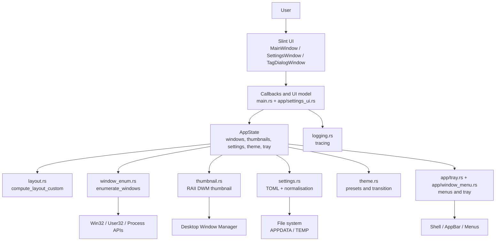
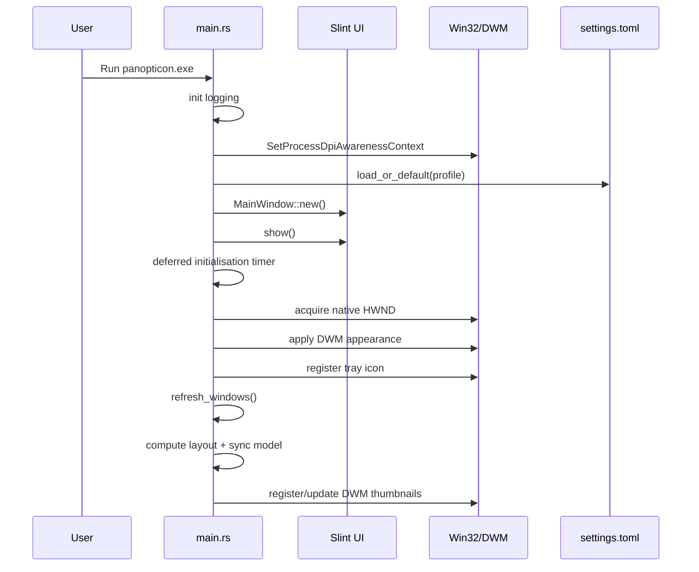

# Panopticon Architecture

## Overview

Panopticon is a native Windows application built around four main pieces:

1. **Win32 enumeration** to discover usable windows.
2. **DWM thumbnails** to render live previews without copying bitmaps.
3. **Pure layout engine** to compute geometry and persistable resize separators.
4. **Slint UI** to present the dashboard, settings, and dialogs.

The project does not use a backend, network, database, or external services. The entire architecture is local and relies on operating-system APIs.

## Layer view



## Startup flow



## Runtime flow

### 1. Window discovery

`window_enum.rs` calls `EnumWindows` and builds `WindowInfo` with:

- `hwnd`
- `title`
- `app_id`
- `process_name`
- `process_path`
- `class_name`
- `monitor_name`

Windows are filtered before entering the main state.

### 2. Visible state materialisation

`main.rs` converts `WindowInfo` into `ManagedWindow`, which adds:

- optional DWM thumbnail;
- target and displayed rectangles;
- thumbnail source size;
- thumbnail refresh timestamps;
- cached icon for secondary rendering.

### 3. Layout

`layout.rs` receives:

```text
(layout, area, count, aspect_hints, custom_ratios)
```

and returns:

```text
LayoutResult { rects, separators }
```

This cleanly separates pure geometry from Win32/Slint integration.

### 4. DWM synchronisation

`update_dwm_thumbnails()`:

- ensures the `Thumbnail` exists;
- computes the real destination rectangle inside the card;
- applies preserve-aspect when appropriate;
- respects viewport, toolbar, padding, and footer;
- handles `Realtime`, `Frozen`, and `Interval` modes;
- releases thumbnails when the source window is minimised or no longer valid.

### 5. UI synchronisation

`sync_model_to_slint()` updates the `ThumbnailData` model and `ResizeHandleData` used by `ui/main.slint`.

## Main modules

| Module | Architectural role |
| --- | --- |
| `src/main.rs` | main orchestration, timers, AppState, callbacks, tray, dock, menus, settings window |
| `src/layout.rs` | pure, testable geometry engine |
| `src/window_enum.rs` | Win32 discovery and initial filtering |
| `src/thumbnail.rs` | RAII wrapper for `HTHUMBNAIL` |
| `src/settings.rs` | persistence, normalisation, and per-app rules |
| `src/theme.rs` | theme catalogue, resolution, and interpolation |
| `src/i18n.rs` | internationalisation (English / Spanish) |
| `src/app/tray.rs` | icons, tray icon, and application menus |
| `src/app/window_menu.rs` | per-window context menu |
| `src/app/settings_ui.rs` | binding between persisted settings and the settings window |
| `ui/main.slint` | visual definition for windows, cards, toolbar, overlays, and dialogs |

## Central state

The runtime revolves around `AppState`, which contains at least:

- main window `hwnd`;
- `ManagedWindow` collection;
- current layout;
- loaded settings;
- hover/selection state;
- tray icon;
- current theme and possible theme animation;
- scroll, dock, and separator information.

It is a large and highly centralised state. This centralisation simplifies event-loop coordination but also makes `main.rs` the densest file in the project.

## Timers and periodic cycles

Panopticon uses three main timers:

| Timer | Frequency | Responsibility |
| --- | --- | --- |
| UI timer | ~16 ms | drain pending actions, detect resize, animate layout, animate theme, re-sync thumbnails |
| Refresh timer | configurable (`1s`, `2s`, `5s`, `10s`) | re-enumerate windows and reconcile state |
| Scrollbar timer | 200 ms | auto-hide overlay scrollbar after inactivity |

## Win32 subclassing

The main Slint window is subclassed to intercept Win32 messages that the declarative UI cannot resolve on its own:

- `WM_TRAYICON`
- `TaskbarCreated`
- `WM_APPBAR_CALLBACK`
- `WM_CLOSE`
- `WM_SIZE`
- `WM_SHOWWINDOW`
- `WM_MOUSEWHEEL`
- `WM_MBUTTONDOWN` / `WM_MBUTTONUP` / `WM_MOUSEMOVE`

This enables tray, dock/appbar, close-to-tray, manual scroll, and specific hotkeys like `Alt`.

## Persistence and profiles

`settings.rs` is the project's persistence layer. It maintains:

- global configuration;
- per-app rules;
- tag styles;
- active filters;
- grouping;
- layout customisations;
- theme name;
- tray, dock, background, and icon options.

It also supports separate per-file profiles and normalises invalid inputs before they reach the runtime.

## Unsafe and security boundaries

The project uses `unsafe` primarily to interoperate with Win32, DWM, Shell, and GDI. The visible architectural rules are:

- keep `unsafe` blocks as small as possible;
- accompany them with `SAFETY` comments;
- encapsulate sensitive handles inside wrappers or helpers when viable;
- keep business logic and geometry outside `unsafe` code.

The areas where `unsafe` appears most:

- Win32 enumeration and FFI callbacks;
- main window subclassing;
- DWM thumbnail registration and update;
- icon generation with GDI;
- tray icon, native menus, and appbar.

## Relevant design decisions

### DWM instead of manual captures

Panopticon prioritises live system thumbnails over self-made screenshots. This reduces CPU work and leverages the system compositor.

### Pure layout engine

`layout.rs` is designed to be computable and testable without depending on the rest of the runtime. This separation is one of the strongest points of the project.

### Persisted settings as source of truth

Filters, groups, themes, and per-app rules are not just ephemeral UI state: the user can close and reopen the application without losing context.

### Tray as the primary operating pattern

Panopticon is designed more as a persistent desktop utility than as a traditional open-and-close window.

## Current architectural limitations

1. `main.rs` concentrates too many responsibilities.
2. Some declarative pieces in `ui/main.slint` appear broader than the currently active runtime.
3. The dock/appbar mode is still concentrated in `main.rs`, complicating evolution and testing.
4. Automated coverage focuses on layout/settings/theme, not on Win32 integration.

## Recommended reading

- [`docs/IMPLEMENTATION.md`](IMPLEMENTATION.md)
- [`docs/SYSTEM_INTEGRATIONS.md`](SYSTEM_INTEGRATIONS.md)
- [`docs/PROJECT_STRUCTURE.md`](PROJECT_STRUCTURE.md)
