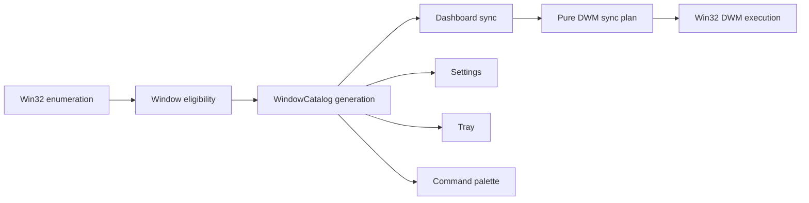

# Revisión de arquitectura — 2026-08-14

## Resumen ejecutivo

El lote fija owners canónicos para eligibility/discovery, planificación DWM, persistencia y resultados
de acciones. Dashboard, Settings, tray y paleta ya no abren caminos independientes de enumeración. El
code map resultante no tiene edges desconocidos.

Estado: **límites principales implementados; dos refactors grandes permanecen diferidos**.

## Alcance y método

- Callers y tests se mapearon desde `docs/codemap/codemap.json` antes de cambiar producto.
- Se revisaron `src/app`, `src/window_enum.rs`, `src/state.rs`, settings, command palette y UI Slint.
- Se mantuvieron API persistida, binario único y wrappers Win32 existentes.
- Fuera del lote: división interna de `settings.rs` (ARCH-03) y páginas Slint físicas (ARCH-05).

## Flujo resultante

## Evidencia y hallazgos

| ID | Estado | Owner / evidencia | Deletion test |
| --- | --- | --- | --- |
| ARCH-01 | Cerrado | `src/window_enum.rs::is_eligible_window` | Tests fallan para PID propio/TextInputHost si se elimina. |
| ARCH-02 | Cerrado | `src/app/window_catalog.rs` | Settings/tray/paleta pierden la generación compartida. |
| ARCH-04 | Cerrado | `src/i18n.rs` + test de claves críticas EN/ES | Una clave faltante falla un test único. |
| ARCH-06 | Parcial | Secundarias siguen registradas, pero eligibility excluye PID propio sin filtros por caller. | Lifecycle global todavía vive en state. |
| ARCH-07 | Cerrado | `src/app/command_palette/catalog.rs` usa snapshot y copy localizado. | Borrar catálogo rompe comandos estáticos/dinámicos. |
| ARCH-08 | Cerrado | `KillProcessError` y resultados visibles. | Stale/access/timeout dejan de colapsar en log genérico. |
| ARCH-09 | Cerrado en el flujo tocado | `persist_settings_snapshot` centraliza save/status/recovery. | Error de save activa banner + Retry/Open logs. |
| ARCH-10 | Cerrado | `DwmWindowSyncPlan` y `DwmSourceState` puros. | Tests cubren invalid/hidden/cloaked y refresh modes. |

## Decisiones y trade-offs

- `WindowCatalog` es crate-private y pequeño; no se añadió una abstracción pública prematura.
- La caché guarda metadata estable; título y monitor se consultan frescos para evitar datos obsoletos.
- El plan DWM decide; el wrapper Win32 ejecuta y conserva bloques `SAFETY` mínimos.
- No se partió el Slint de 3,600+ líneas durante un lote con cambios visuales para evitar riesgo de
  paridad no relacionado.

## Plan priorizado

1. ARCH-03: partir settings por dominios conservando la façade pública, cuando haya un cambio real ahí.
2. ARCH-05: extraer seis page components con matriz visual antes/después.
3. Completar ARCH-06 solo si un nuevo lifecycle de ventana secundaria lo necesita.

## Verificación

- 170 tests PASS; check, fmt, Clippy pedantic y release PASS.
- Code map final: 14 nodos, 16 edges, 4 flows y 0 unknown (se regenera al cierre).
- Runtime release probó consumers compartidos y UIA en dashboard/Settings/paleta.

## Riesgos residuales

- `settings_window.slint` sigue siendo grande aunque su contrato raíz permanece estable.
- Startup y lifecycle Win32 aún requieren integración manual para tray/appbar/Explorer.
- No se ejercitó una denegación real de permisos al matar un proceso.
